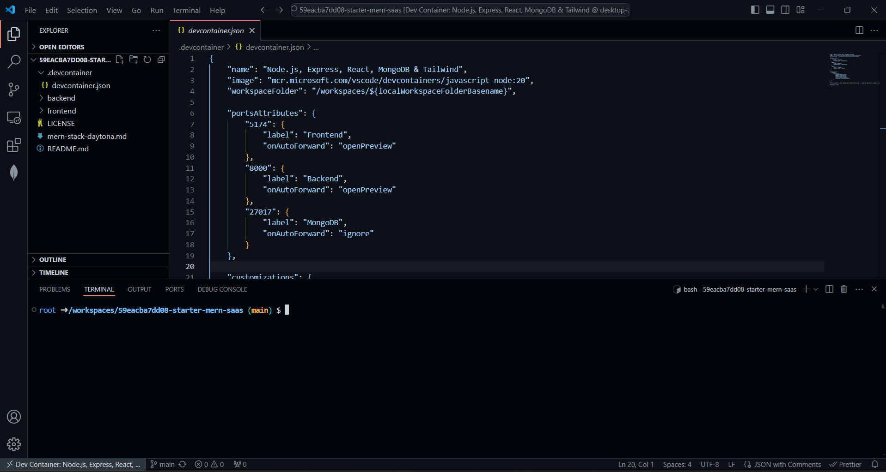
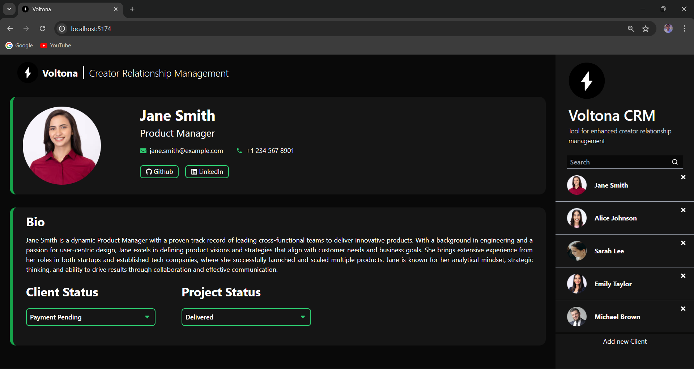

# **MERN Stack: A Starter Guide for Developers**

One of the most popular frameworks for modern web development is the MERN stack. Combining MongoDB, Express.js, React.js, and Node.js, it equips developers with a powerful toolkit to create dynamic and high-performing web applications.

Efficient development setups are essential for productivity, and in this guide, we'll streamline the process by using a pre-configured repository with a basic MERN stack app that you can clone as a starting point. To further enhance the setup, we'll leverage Daytona to manage our development environment, ensuring a seamless and efficient workflow.

Whether you're working on your local machine or a remote server, this guide will provide you with the steps to quickly get up and running with the MERN stack.

#### **Overview of MERN Stack**

MERN stack is a powerful combination of four technologies:

- **MongoDB**: A NoSQL database that stores data in flexible, JSON-like documents.
- **Express.js**: A minimal web application framework for Node.js, enabling robust API creation.
- **React.js**: A JavaScript library for building user interfaces, particularly for single-page applications where data changes over time.
- **Node.js**: A JavaScript runtime for building fast, scalable network applications.

Each component of the MERN stack plays a crucial role in the development process, providing a seamless integration that allows for the creation of dynamic and interactive web applications.

## Setting Up the Development Environment

Before we dive into setting up your MERN stack environment, let's make sure you have the necessary tools and a basic understanding to follow along smoothly. Here are the prerequisites you'll need:

#### **Prerequisites**
- Basic understanding of JavaScript.
- IDE (Integrated Development Environment) such as Visual Studio Code (VSC).
- Docker installed as a provider for spinning up the Daytona workspace inside the container.

#### **Getting Started with the MERN App**

We’ve prepared a comprehensive example repository to facilitate your initiation into the MERN stack.  
<br/>We're using the Creator Relationship Management (CRM) App, a full-stack web application designed for influencers, podcasters, and creators. It efficiently manages and showcases client relationships with features like client data management, responsive design, search capabilities, interaction tracking, and project management.

App utilizes MongoDB for data management, Node.js and Express.js for the server-side framework, and React.js with Tailwind CSS for a dynamic user interface.

#### **Setting up MongoDB Cluster**

To set up MongoDB, refer to the [MongoDB Atlas Getting Started guide](https://www.mongodb.com/docs/atlas/getting-started/). This guide will walk you through creating a MongoDB cluster, getting the Mongo URI, and adding your IP address to the network access settings. Once you have your Mongo URI, you can integrate it into your project configuration.

**NOTE**: If you encounter problems connecting to the database, go to your MongoDB cluster's "Network Access" settings, click "Add IP Address," and select "Allow Access from Anywhere."

#### **Setting up Daytona for Development Workspace**

Setting up a local development environment can be painful due to version mismatches and configuration issues. [Daytona](https://www.daytona.io/) automatically sets up a Node.js environment with necessary tools, manages port forwarding seamlessly, and runs essential post-create commands, ensuring a consistent, ready-to-use setup that minimizes manual configuration.

To set up Daytona, refer to the [Daytona installation documentation](https://www.daytona.io/docs/installation/installation/). This guide provides detailed steps to get Daytona up and running efficiently, ensuring your development environment is well-configured.

#### **Cloning and Setting Up Your MERN Stack Environment:**

Step 1: Create a Workspace

- Initiate the process by executing the following command using this Git URL for the repository:
```
daytona create https://github.com/daytonaio-experiments/starter-mern-saas.git
```
Step 2: Set a Preferred IDE

- To set up your preferred IDE, list all supported IDEs using the following command and select from them.
```
daytona ide
```

Step 3: Open the Workspace

- Once you've selected your preferred IDE, open the Workspace by executing the following command. Select the workspace created above for this project, and it will open in your chosen IDE.
```
daytona code
```

After following these commands, the repository will open in your preferred IDE.



Step 4: Starting the Backend Server

Create a .env file in the backend directory and add the following line inside it. Change the string below to match your MongoDB connection URI.
```
MONGO_URI="mongodb+srv://<username>:<password>@cluster0.ce6av93.mongodb.net/?retryWrites=true&w=majority&appName=Cluster0"
```

- Start the backend server by navigating to the backend directory and running:

```
npm run dev
```

Step 5: Starting the Frontend

- Create a .env file in the frontend directory and add the following line:

```
VITE_BACKEND_URL="http://localhost:8000/api/customers/"
```

- Start the frontend server by navigating to the frontend directory and running:

```
npm run dev
```

Your MERN app should now be up and running.



#### **Structure of MERN Repository**

The repository is organized into several key directories and files to facilitate efficient development:

- **Backend**: This directory includes all server-side code, primarily using Node.js and Express.js.
- **Frontend**: Contains the client-side application built with React.js and styled with Tailwind CSS.
- **.devcontainer:** Configuration files for setting up a consistent development environment with Daytona, including the devcontainer.json file.

## Effortless Setup: Daytona and .devcontainer in Action

[Daytona](https://www.daytona.io/) provides a powerful development workspace that simplifies the setup and management of development environments, whether locally or remotely.

By automating the setup and maintenance of development environments, Daytona enables developers to focus on core tasks, reducing time spent on non-productive activities and increasing overall efficiency.

Daytona enhances developer productivity by offering a standardized and scalable platform, allowing developers to easily set up and access their development environments from anywhere, eliminating the need for local machine configurations.

Daytona streamlines the setup process of our MERN stack application, ensuring a consistent and efficient development experience across different machines.

#### **Using .devcontainer for Development**

devcontainer.json configuration provides a predefined development environment using Docker containers. Here’s the configuration used in this project:

```json
{
    "name": "Node.js, Express, React, MongoDB & Tailwind",
    "image": "ubuntu:22.04",
    "features": {
        "ghcr.io/devcontainers/features/common-utils:2.4.7": {
            "username": "daytona",
            "userUid": 1000,
            "userGid": 1000,
            "configureZshAsDefaultShell": true
        },
        "ghcr.io/devcontainers/features/node:1": {
            "nodeGypDependencies": true,
            "version": "lts",
            "nvmVersion": "0.40.0"
        },
        "ghcr.io/devcontainers/features/git:1": {}
    },
    "overrideFeatureInstallOrder": [
        "ghcr.io/devcontainers/features/common-utils",
        "ghcr.io/devcontainers/features/git",
        "ghcr.io/devcontainers/features/node"
    ],
    "portsAttributes": {
        "5174": {
            "label": "Frontend",
            "onAutoForward": "notify"
        },
        "8000": {
            "label": "Backend",
            "onAutoForward": "ignore"
        },
        "27017": {
            "label": "MongoDB",
            "onAutoForward": "ignore"
        }
    },
    "customizations": {
        "vscode": {
            "extensions": [
                "mongodb.mongodb-vscode",
                "dbaeumer.vscode-eslint",
                "esbenp.prettier-vscode",
                "bradlc.vscode-tailwindcss",
                "davidanson.vscode-markdownlint"
            ]
        }
    },
    "workspaceFolder": "/workspaces/starter-mern-saas",
    "onCreateCommand": "npm install -g nodemon",
    "postCreateCommand": "cd backend && npm install && cd ../frontend && npm install",
    "remoteUser": "daytona"
}
```
This configuration includes:

- **name**: Specifies the name of the development environment.
- **image**: Uses the `ubuntu:22.04` Docker image as the base for the development environment.
- **features**:
  - **common-utils**: Adds common utilities (e.g., Zsh) with configurations for the user "daytona" (UID: 1000, GID: 1000) and sets Zsh as the default shell.
  - **node**: Installs the LTS version of Node.js with dependencies for `node-gyp` and manages Node versions using NVM 0.40.0.
  - **git**: Installs Git to manage source code versioning.
- **overrideFeatureInstallOrder**: Specifies the order of feature installation to ensure common utilities, Git, and Node.js are set up in the correct sequence.
- **portsAttributes**: Sets up port forwarding with labels for the frontend (5174), backend (8000), and MongoDB (27017) services.
- **customizations**: Installs essential Visual Studio Code extensions, including support for MongoDB, ESLint, Prettier, Tailwind CSS, and Markdown linting.
- **workspaceFolder**: Sets the workspace folder to `/workspaces/starter-mern-saas`.
- **onCreateCommand**: Installs `nodemon` globally using `npm install -g nodemon`.
- **postCreateCommand**: Installs dependencies in both the backend and frontend directories using `npm install`.
- **remoteUser**: Sets "daytona" as the remote user for running commands within the container.

Daytona’s integration with .devcontainer allows us to create a consistent development environment that is easily reproducible.

This is particularly beneficial for our MERN stack application, as it ensures all team members work in the same environment, avoiding issues related to local machine configurations. Seamless setup of ports for the front end and backend enhances the development experience, allowing for quick previews and efficient debugging.

## Breaking Down the MERN Stack: How Everything Comes Together 

Now that we've successfully set up and run our MERN stack application, it's time to delve deeper into its structure. Let's break down the different components of our application to see how they work together seamlessly.

#### **Overview of the Backend Structure**

Let’s dive into the backend structure to see how everything fits together. Our backend is designed to keep things organized and maintainable. Here’s how we’ve set it up:

- **Models**: This directory contains Mongoose models, which define the structure of your MongoDB documents, such as customer.js.
- **Routes**: This directory houses the route handlers that map HTTP requests to controller functions, like customerRoutes.js.
- **Services**: Business logic is separated into service files, promoting modular and maintainable code, such as customerService.js.
- **Main Files**:
  - app.js: Initializes the Express app and configures middleware.
  - database.js: Sets up and manages the MongoDB connection.
  - index.js: Entry point that starts the server.

**Server Setup, Routes, and API Endpoints**

- **Server Setup**: In app.js, the Express application is created, and middleware like body-parser and CORS are configured.
- **Routes**: Defined in customerRoutes.js, routes are linked to controller functions for handling requests.
- **API Endpoints**: Examples include /customers for fetching all customers and /customers/:id for fetching, updating, or deleting a specific customer.

#### **Overview of the Frontend Structure**

Our frontend is built for clarity and scalability, making it easy to navigate and expand as needed. Here’s a look at how it’s organized:

- **public/**: Contains static files used in application.
- **src/**: Holds the React components and other frontend logic.
  - **assets/**: Stores static assets such as images.
  - **components/**: Contains all React components
  - **App.css**: Main CSS file for the app.
  - **App.jsx**: Root component that sets up the app structure.
  - **index.css**: Global CSS file.
  - **state.js**: Manages application state.

**Main Components and State Management**

- **Main Components**: App.jsx (main application component), main.jsx (main entry point rendering the app), and other specific components under components/.
- **State Management**: Using React's useState and useEffect hooks for state management, e.g., fetching and displaying data in App.jsx.

#### **Overview of MongoDB Database**
Database is the backbone of our application, and setting it up correctly is crucial. Here’s how we’ve configured it:

- **Configuration**: MongoDB connection settings in database.js and the .env file.
- **Connection Setup**: Using Mongoose, the database.js file connects to MongoDB. Ensure the MongoDB URI is configured in your environment variables.
- **Required Packages**: Mongoose for object data modeling.

## Customizing the MERN Application
Customizing your application allows you to tailor the functionality and user experience to better meet your specific requirements. By adding new routes and components or modifying existing ones, you'll gain hands-on experience with both the backend and frontend aspects of the MERN stack.

Here are some example customizations that you can follow to get a hands-on understanding of how MERN applications work.
#### **Adding New Routes and Modifying Existing**

To customize the backend logic of your MERN application, you can add new routes or modify existing ones as per your requirements.

**Adding New Routes**

1. **Define the Route**: Create a new route file in the routes directory or add a new route handler in an existing file. For example, to add a new product route:

**productRoutes.js**
```
const express = require('express');
const router = express.Router();
const productService = require('../service/productService');

router.get('/products', async (req, res) => {
    try {
        const products = await productService.getAllProducts();
        res.status(200).json(products);
    } catch (error) {
        res.status(500).json({ message: error.message });
    }
});

module.exports = router;
```

2. **Create Controller Functions**: Implement the logic for the new routes in a service file.

**productServices.js**
```

class ProductService {
    async getAllProducts() {
        // Logic to fetch all products
    }
}

module.exports = ProductService;

```

3. **Update App Configuration**: Register the new route in app.js.

**app.js**
```
const productRoutes = require('./routes/productRoutes');

app.use('/api', productRoutes);
```

**Modifying Existing Routes**

- **Update Route Handlers**: Modify the logic in existing route files or controller functions as needed.
- **Test Changes**: Ensure new functionality works as expected by testing the updated endpoints.

#### **Adding New React Components and Modifying Existing Ones**

To enhance the frontend of your MERN application, you can add new components or modify existing ones:

**Adding New Components**

1. **Create Component File**: In the src/components directory, create a new component file, for example, ProductList.jsx.

**ProductList.jsx**
```
import React, { useEffect, useState } from 'react';
import axios from 'axios';

const ProductList = () => {
    const [products, setProducts] = useState([]);

    useEffect(() => {
        const fetchProducts = async () => {
            const response = await axios.get('/api/products');
            setProducts(response.data);
        };
        fetchProducts();
    }, []);

    return (
        <div>
            <h1>Products</h1>
            <ul>
                {products.map(product => (
                    <li key={product.id}>{product.name}</li>
                ))}
            </ul>
        </div>
    );
};

export default ProductList;

```

2. **Integrate Component**: Import and use the new component in App.jsx.

**App.jsx**
```
import React from 'react';
import ProductList from './components/ProductList';

function App() {
    return (
        <div className="App">
            <ProductList />
        </div>
    );
}

export default App;
```

**Modifying Existing Components**

- **Edit Component Logic**: Open the component file you wish to modify and update the JSX or state logic as needed.
- **Test Changes**: Ensure the updated component works correctly by running the application and verifying the changes.

## Conclusion

Congratulations! You have successfully set up your MERN stack application, cloned the example repository, and customized both the backend and frontend. With [Daytona](https://www.daytona.io/), you’ve ensured a consistent and efficient development environment, significantly simplifying the setup process and enhancing productivity. By leveraging Daytona's capabilities, you've streamlined the complexities of local setup, ensuring a seamless and uniform workspace for all developers involved.

Now, you can focus on developing and enhancing your application without worrying about environmental inconsistencies or setup issues. If you encounter any challenges or have further questions, the Daytona team is readily available to assist you on [Slack](https://go.daytona.io/slack), or you can open an issue on the [Daytona GitHub](https://github.com/daytonaio/daytona) repository. Happy coding, and enjoy your development journey with the MERN stack!
